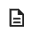

<h2 class="c-project-heading--task">Style it with CSS</h2>
--- task ---
Use the style.css file to customise the page. 
--- /task ---

<h2 class="c-project-heading--explainer">Make the room your own! 💅</h2>

Your layout is now working — great job! Now it is time to give your webpage a creative twist.

Open the `style.css` file (the file icon is on the left) . 

Close the gap between the tiles.

--- code ---
---
language: css
filename: style.css
line_numbers: true
line_number_start: 4
line_highlights: 7
---
.grid {
    display: grid;
    grid-template-columns: repeat(4, 1fr);
    gap: 2px;
    max-width: 400px;
    margin: 0;
}
--- /code ---

Have fun making the page your own!

You could also change the heading:

- Add a fun colour to the heading
- Change the font style

Here’s an example:

--- code ---
---
language: css
filename: style.css
line_numbers: true
line_number_start: 1
line_highlights: 2-5
---
h1 {
    color: teal;
    font-family: "Comic Sans MS", cursive, sans-serif;
    text-shadow: 2px 2px #ffcc00;
    text-align: center;
}
--- /code ---

### Tip

You can style any part of the page using CSS — try changing the tile borders!

### Try this

Try giving your tiles a rainbow look! You can change the border colour of different tiles like this:

    .tile:nth-child(1) img {
        border-color: red;
    }

    .tile:nth-child(2) img {
        border-color: orange;
    }

    .tile:nth-child(3) img {
        border-color: yellow;
    }

Keep going with more colours to make a rainbow grid!

